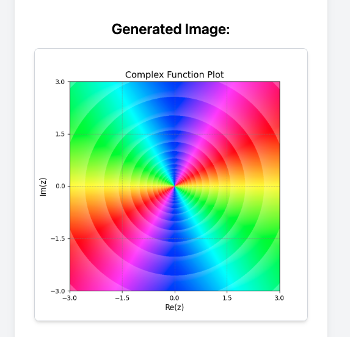

# Web App with  Complex Domain Colouring tool
Flask app for complex function plotter using domain coloring

## Usage
 1. `git clone https://github.com/Vorashil/complex-domain-colouring.git`
 2. `cd complex-domain-colouring`
 3. Install python 3 and virtualenv
 4. `virtualenv venv`
 5. `source venv/bin/activate`
 6. `pip install -r requirements.txt`
 7. Run by typing `python app.py` on your terminal

## Sources
This project is the extension of following script
https://github.com/Ducolnd/complex

